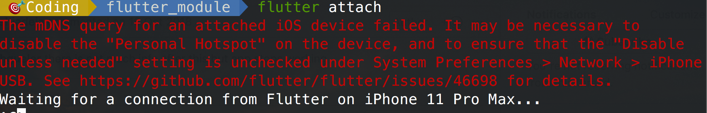
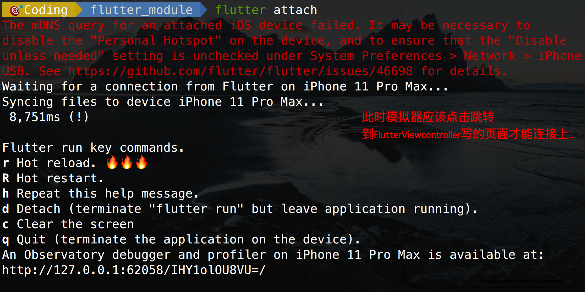
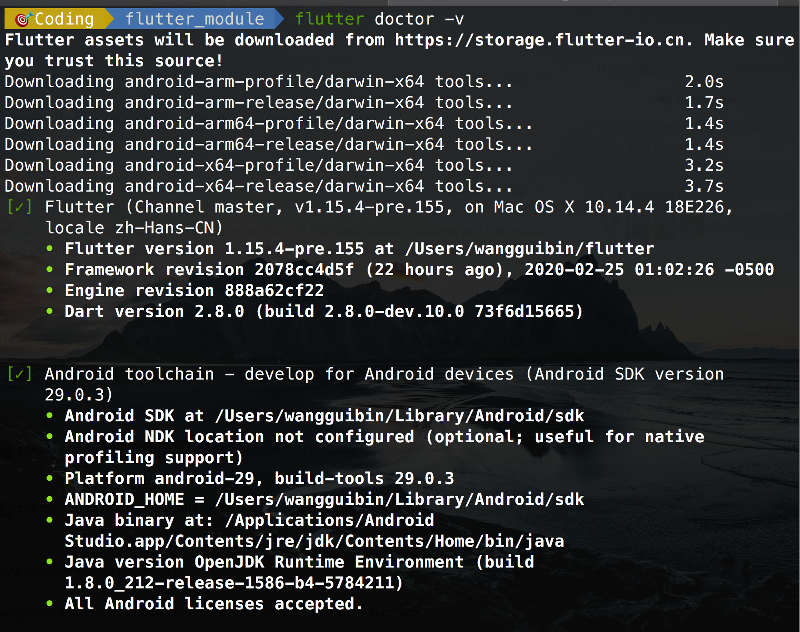
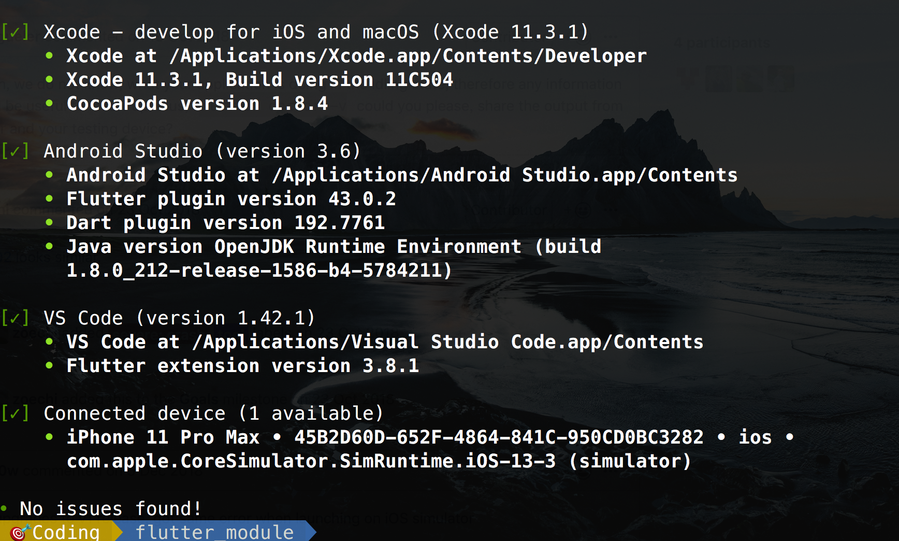
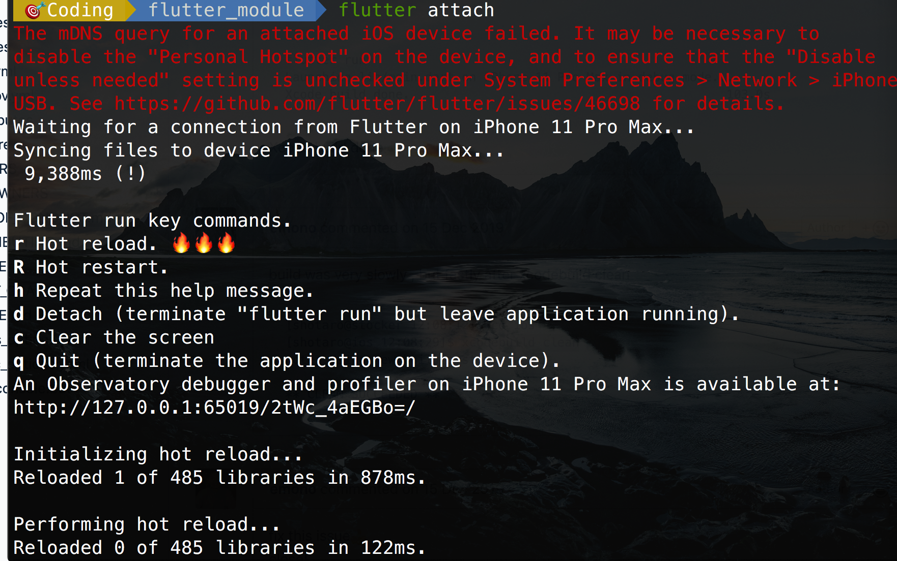

# 现有OC项目与Flutter混编

>  现有原生项目里新功能新模块采用Flutter来写, 解决痛点是Android现有项目也可复用同一份flutter代码,改改配置即可,很大程度上提升了开发效率,不用在两端花费大量时间画同一份UI,写同一个功能,
>
>  flutter module搞起 ,dart文件拖过去,配置配置就完了

## [查看官方文档混编教程](https://flutter.dev/docs/development/add-to-app/ios/project-setup)

### 第一步,建立flutter module

```shell
flutter create -t module <flutter_module_name>
```

### 第二步,配置混编项目

把新建的`flutter_module`放到与原生项目ios_mix同一级目录下,

```ruby
.
├── flutter_module #flutter代码
└── ios_mix  #原生代码

# 这里需要在ios_mix原生项目里配置podFile
platform :ios, '9.0'

#加载辅助模块
flutter_application_path = '../flutter_module'
load File.join(flutter_application_path, '.ios', 'Flutter', 'podhelper.rb')

target 'FlutterMixedOCDemo' do
  use_frameworks!
  install_all_flutter_pods(flutter_application_path) #安装flutter sdk混编依赖
  pod 'AFNetworking'
end

```

###  第三步, 更新和安装依赖库

```ruby
# cd 到 flutter_module 目录下执行
 flutter pub get 

# cd 到 ios_mix 目录下执行
 pod install

# 完事之后, cmd + B 编译成功即可开始写写平台衔接代码
```

### 第四步, 开始写代码

##### 1.  修改`AppDelegate` 启动引擎, hook入口函数

```objective-c
#import <UIKit/UIKit.h>
#import <Flutter/Flutter.h>

@interface AppDelegate : FlutterAppDelegate

@property (nonatomic,strong) FlutterEngine *flutterEngine;

@end

  
#import <FlutterPluginRegistrant/GeneratedPluginRegistrant.h> // Used to connect plugins.
  
#import "AppDelegate.h"

@implementation AppDelegate

- (BOOL)application:(UIApplication *)application
    didFinishLaunchingWithOptions:(NSDictionary<UIApplicationLaunchOptionsKey, id> *)launchOptions {
  self.flutterEngine = [[FlutterEngine alloc] initWithName:@"my flutter engine"];
  // Runs the default Dart entrypoint with a default Flutter route.
  [self.flutterEngine run];
  [GeneratedPluginRegistrant registerWithRegistry:self.flutterEngine];
  return [super application:application didFinishLaunchingWithOptions:launchOptions];
}

@end
  
```

##### 2. 跳转到flutter控制器的代码

```objc
//控制器跳转代码
#import <Flutter/Flutter.h>
#import "AppDelegate.h"

#在按钮点击回调处或者事件交互处调用即可
    FlutterEngine *flutterEngine = ((AppDelegate *)UIApplication.sharedApplication.delegate).flutterEngine;
    FlutterViewController *flutterViewController =
    [[FlutterViewController alloc] initWithEngine:flutterEngine nibName:nil bundle:nil];
    [self.navigationController pushViewController: flutterViewController animated:YES];
//    flutterViewController.modalPresentationStyle = UIModalPresentationFullScreen;
//    [self presentViewController:flutterViewController animated:YES completion:nil];

```


### 第五步, 尝试运行和热更新

1. 先在终端cd到flutter_module下执行`flutter attach`尝试连接模拟器



2. Xcode运行项目,并点击按钮跳转到flutter页面,此时终端日志打印如下:



我开始有点🥰兴奋,以为成功了,一看模拟器是`白屏`

然后我去修改了`main.dart`文件的代码

```dart
import 'package:flutter/material.dart';

void main() => runApp(MyApp());

class MyApp extends StatelessWidget {
  // This widget is the root of your application.
  @override
  Widget build(BuildContext context) {
    return MaterialApp(
        title: 'Flutter Demo',
        theme: ThemeData(
          primarySwatch: Colors.blue,
        ),
        home: Scaffold(
          appBar: AppBar(title: Text("电影海报")),
          body: GridView(
            gridDelegate: SliverGridDelegateWithFixedCrossAxisCount(
                crossAxisCount: 3, //一行几个
                mainAxisSpacing: 2.0, //主轴间隙
                crossAxisSpacing: 2.0, //交叉轴间隙
                childAspectRatio: 0.75 //宽高比例
                ),
            children: <Widget>[
              new Image.network("http://img5.mtime.cn/mg/2019/12/06/151725.72056401_170X256X4.jpg", fit: BoxFit.cover),
              new Image.network("http://img5.mtime.cn/mg/2019/12/27/102157.68986647_170X256X4.jpg", fit: BoxFit.cover),
              new Image.network("http://img5.mtime.cn/mg/2019/12/17/105244.25525559_170X256X4.jpg", fit: BoxFit.cover),
              new Image.network("http://img5.mtime.cn/mg/2019/12/27/101620.49593666_170X256X4.jpg", fit: BoxFit.cover),
              new Image.network("http://img5.mtime.cn/mg/2019/12/16/102340.68068947_170X256X4.jpg", fit: BoxFit.cover),
              new Image.network("http://img5.mtime.cn/mg/2020/01/16/151219.82587599_170X256X4.jpg", fit: BoxFit.cover),
              new Image.network("http://img5.mtime.cn/mg/2019/12/16/160312.57013739_170X256X4.jpg", fit: BoxFit.cover),
              new Image.network("http://img5.mtime.cn/mg/2019/12/09/170926.23949705_170X256X4.jpg", fit: BoxFit.cover),
              new Image.network("http://img5.mtime.cn/mg/2019/12/27/101324.51348949_170X256X4.jpg", fit: BoxFit.cover),
              new Image.network("http://img5.mtime.cn/mg/2019/12/06/151725.72056401_170X256X4.jpg", fit: BoxFit.cover),
              new Image.network("http://img5.mtime.cn/mg/2019/12/27/102157.68986647_170X256X4.jpg", fit: BoxFit.cover),
              new Image.network("http://img5.mtime.cn/mg/2019/12/17/105244.25525559_170X256X4.jpg", fit: BoxFit.cover),
              new Image.network("http://img5.mtime.cn/mg/2019/12/27/101620.49593666_170X256X4.jpg", fit: BoxFit.cover),
              new Image.network("http://img5.mtime.cn/mg/2019/12/16/102340.68068947_170X256X4.jpg", fit: BoxFit.cover),
              new Image.network("http://img5.mtime.cn/mg/2020/01/16/151219.82587599_170X256X4.jpg", fit: BoxFit.cover),
              new Image.network("http://img5.mtime.cn/mg/2019/12/16/160312.57013739_170X256X4.jpg", fit: BoxFit.cover),
              new Image.network("http://img5.mtime.cn/mg/2019/12/09/170926.23949705_170X256X4.jpg", fit: BoxFit.cover),
              new Image.network("http://img5.mtime.cn/mg/2019/12/27/101324.51348949_170X256X4.jpg", fit: BoxFit.cover)
            ],
          ),
        ));
  }
}

```

完事之后,貌似也不行,几番搜索说执行`flutter doctor -v`检测一下环境 ,然后环境全都是装好的✔️





没得办法之后,我选择在终端执行了`flutter run` 没想到真的运行起来了,然鹅不是混编项目,而是纯flutter的,也把Android的配置也生成了...  

死马当活马医的办法,然后重新`flutter attach`了一遍还是和之前一样等待中,等我把Xcode运行起来那一刻,我点击按钮跳到flutter页面,里面果然有点东西了


然后我尝试修改main.dart文件的内容,本来有appBar的,我把它注释了,在终端按下`r`,然后模拟器隐藏了AppBar,终端日志如下:




### 最后就可以愉快的玩耍了!!!

